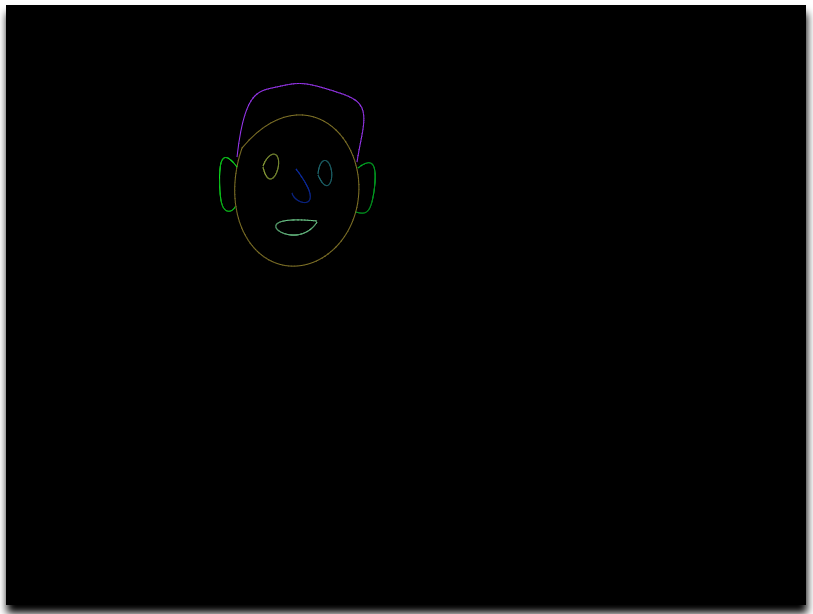

# bezier-curve

Welcome to the magical world of [Bézier Curves](https://en.wikipedia.org/wiki/B%C3%A9zier_curve).

Draw cool arts using Bezier curves [here](https://silwalanish.github.io/bezier-curve/).

This repository implements the [De Casteljau's algorithm](https://en.wikipedia.org/wiki/De_Casteljau%27s_algorithm) to visualize the Bézier curves.

## Inspiration
- [The Beauty of Bézier Curves - Freya Holmer](https://youtu.be/aVwxzDHniEw)

## Features
- [x] Add curve.
- [x] Remove curve.
- [x] Select single curve.
- [x] Deselect curve.
- [x] Add control points.
- [x] Move control points.
- [x] Remove control points.
- [x] Select single control point.
- [x] Deselect control point.
- [ ] Save the picture as image.
- [ ] Copy the picture to clipboard as image.
- [ ] Export the picture as SVG.
- [ ] Add ability to add control points in the middle as well.
- [ ] Color picker for curve.
- [ ] Select multiple curves with CTRL+click.
- [ ] Select multiple curves using selection rectangle.
- [ ] Select multiple control points with CTRL+click.
- [ ] Select multiple control points using selection rectangle.
- [ ] Move/Remove the selected curves.
- [ ] Move/Remove the selected control points.
- [ ] Zoom in and out in the canvas.
- [ ] Move the canvas around by dragging.
- [ ] Make website pretty.

## License
[MIT](LICENSE)
